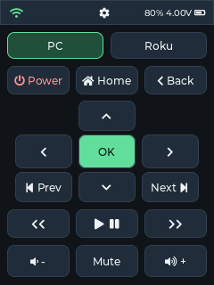
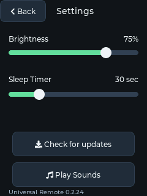

# ESP32 LVGL interface

The firmware uses LVGL 9.2.2 for the existing 240×320 Home and Settings layout. Rounded charcoal controls, green selection accents, antialiased built-in fonts/icons, and pressed states replace the 5×7 pixel font and hand-drawn controls. The original ST7789 pins, initialization, portrait mapping, inversion, and 20 MHz SPI clock remain intact.

## Rendering and ownership

`display.cpp` creates two persistent widget trees and one 240×32 RGB565 render buffer (15,360 bytes of internal heap). LVGL renders changed regions; the flush callback swaps RGB565 byte order and writes each rectangle through `SPI.writeBytes`. No full framebuffer, DMA, asset downloads, or continuous animations are used. Buffer allocation failure returns before LVGL initialization, leaving the main loop and physical power controls available.

The main loop supplies normalized touch samples and calls `serviceDisplay()` roughly every 5 ms while awake. LVGL refreshes dirty regions on a 16 ms timer. Widget callbacks enqueue actions; the main loop applies commands, audio, brightness, and preferences after LVGL returns. Buttons fire once on press. Sliders support dragging and tapping; values change live and NVS is written only for changed settings on release, navigation, screen sleep, or maintenance. A stored sleep value of zero remains Off until adjusted; the slider retains its existing 2–120 second range.

CST3530 IRQ-high samples mean no new report, so the last press/coordinates persist through gaps. Empty reports from SensorLib start a 25 ms release filter; a subsequent down report cancels it. Navigation and wake gestures are suppressed through release. SensorLib does not distinguish an empty release from a failed read, so electrical/I2C faults and actual controller release timing still need hardware testing.

## Normal networking and maintenance

One FreeRTOS worker owns command POSTs and Find Remote polling. Its eight-entry FIFO copies device/command at submission, prefers outgoing work over polls, expires unsent requests at three seconds, and never retries a POST. Offline/full/busy rejections and command failures appear as temporary messages. HTTP connect/read timeouts are one/two seconds; unsuccessful polls back off through 1, 2, 4, 8, and 10 seconds, returning to the existing five-second interval on success. Polling is deferred during audio. The current server's small Content-Length JSON polling response is bounded to 255 bytes and a two-second body read.

Only the main loop touches LVGL, audio, and preferences. Worker completions return through a bounded queue; generations discard stale results across pauses. Sleep and maintenance stop new work and discard queued commands, then wait cooperatively for the active request. Sleep keeps its ten-second preparation deadline; maintenance postpones after five seconds if the worker remains busy. No network work overlaps the actual Wi-Fi-off sleep transition or installation.

Settings and serial update commands enter a dedicated maintenance state, stop ordinary audio before file changes, and flush the status message before synchronous SD/OTA work. Normal input resumes after completion and release. Downloads and their existing sound waits remain blocking by design. No server endpoints or payloads changed.

## Validation and hardware acceptance

The final PlatformIO build passed with Espressif32 7.0.1 / Arduino ESP32 2.0.17. Static RAM is 118,556 / 327,680 bytes (36.2%); application flash is 1,531,641 / 6,291,456 bytes (24.3%). The render buffer, network task stack, queues, Wi-Fi, and audio also consume runtime heap. Existing `config.h` C++17 inline-variable warnings remain. Firmware version is unchanged at 0.2.24.

Host checks run with `python3 firmware/esp32_remote/tests/run_host_tests.py --build-dir /tmp/remote-lvgl-host`. They exercise the production policies and the real LVGL screens, including every control, holds, slider taps/drags, wake/navigation suppression, partial redraws, and allocation failure. The runner produces PNG captures for visual inspection; these are rendered software previews, not photographs of the LCD.

| Home preview | Settings preview |
| --- | --- |
|  |  |

Before release, perform these checks on the Waveshare V2 board:

1. Check RGB colors, orientation, status percentage/voltage, all labels/icons, and both screens. Verify all PC/Roku commands reach the selected device exactly once per press, including a stationary ten-second hold and rapid lift/re-tap.
2. Drag both sliders to their endpoints and outside their tracks. Confirm live updates, one save per changed release, persistence after reboot, stored Off preservation, and saving when the physical sleep button interrupts a drag.
3. Use a slow/unavailable server while tapping, dragging, and playing audio. Target visible press feedback within 100 ms; measure with high-frame-rate video. The serial `i` command reports maximum LVGL service/rectangle-transfer durations and current free heap for diagnosis, not end-to-end touch latency.
4. Fill the outgoing queue, change PC/Roku selection, disconnect/reconnect Wi-Fi, and confirm captured routing, ordered sends, visible rejections, expiry, and no delayed toggle replay. Verify Find Remote and pickup still work.
5. Repeat the reliability audit's GPIO18 sleep/wake checks on USB and battery, including a request in flight, unavailable Wi-Fi, held button, timeout cancellation, and twenty cycles. Verify first-touch wake consumption and motion wake. Check current draw separately.
6. Run Settings and serial firmware/SD updates. Confirm a visible busy message, no normal worker request or ordinary audio overlaps installation, and a held update touch does not trigger a second install after return. Confirm low-battery shutdown behavior.

Hardware timing, real HTTP outage behavior, electrical touch release, audio under load, current draw, and installations are not certified by the host tests or a successful firmware build. No flashing or publishing is part of this change.
